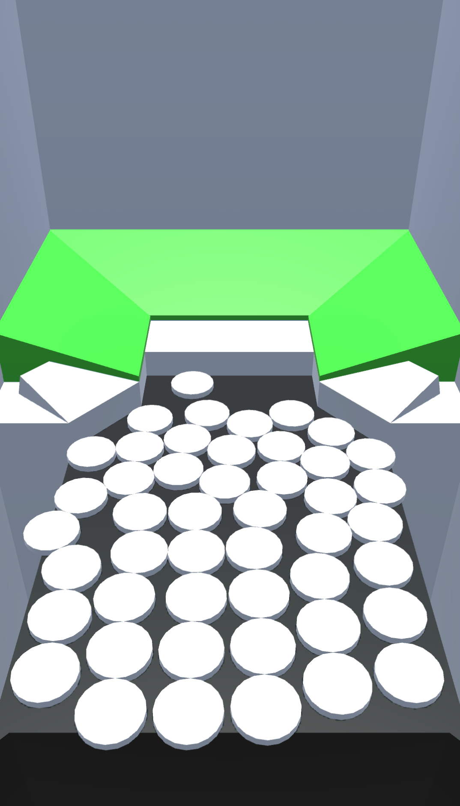

# coin-dozer-unity

Prototype for an Android Coin Dozer Untity game.

Small project for killing some time. 

# "Features"
- Somewhat optimized pooling of the movable objects
- Serialization in json (also kinda crypt it for "harder" data manipulation)

Basic prototype is working fine. It's only a matter of adding more power-ups, changing the models, creating the UI to finish the game.
*Not really interested myself to finish it because I don't like user interface design and polishing unity games*

 